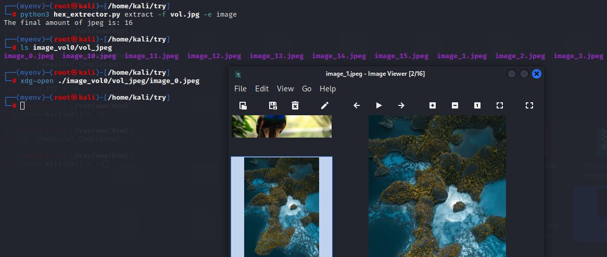

<h1 align="center">
  Steg_Py_Graphy
</h1>

The "Steg_Py_Graphy" tool is a valuable asset for professionals in the fields of digital forensics and cybersecurity. 
With its user-friendly design and ability to handle various media formats, it empowers users to unveil hidden data within multimedia files, 
thereby aiding in the detection and analysis of potential security threats and concealed information.

<h2 align="center">
  Description
</h2>

The "Steg_Py_Graphy" tool is a powerful tool for reverse steganography, capable of extracting concealed data from various digital media files,
including audio, video, and image formats. With its efficient scanning algorithm and support for multiple file types,
this script enables users to reveal hidden information for digital forensics, security analysis, and investigation purposes.

<h2 align="center">
  Built-in Libraries
</h2>

This tool utilizes the following built-in libraries in Python:

- [`os`](https://docs.python.org/3/library/os.html): This library provides a way to interact with the operating system, allowing the tool to perform various file and directory operations.

- [`platform`](https://docs.python.org/3/library/platform.html): The `platform` library is used to retrieve information about the underlying system, such as the operating system name, version, and hardware architecture.

- [`argparse`](https://docs.python.org/3/library/argparse.html): Used for command-line argument parsing.

<h2 align="center">
  Usage
</h2>

To use the "Steg_Py_Graphy" tool, run the `hex_extrector.py` script with the desired sub-command and options. 
The sub-command that are available are:
- Sub-command: extract
  - -f/--file-name: The file to extract from the objects.
  - -F/--files-names: The files to extract from the objects.
  - -e/--extract-type: Specify the extract type from the list of ['image', 'audio', 'video', 'all'].

<h3 align="center">
  Extract Files
</h3>

To extract files from a multimedia file, use the `extract` sub-command. Specify the file name and the extract type.
Available extract types:
- image
  - Formats are jpeg, png, gif, svg, exif.
- audio
  - Formats are:  wav, mp3, m4a, mka, mp4.
- video
  - Formats are: wmv, mkv, avi, mp4.
- all
  - Formats are: image formats + audio formats + video formats

<h2 align="center">
  Features
</h2>

The "Steg_Py_Graphy" tool includes the following features:

- Extract images from a file:
   - Usage: `python steg_py_graphy.py extract -f <file_name> -e image`
   - Example image:
  

- Extract audio files from a file:
   - Usage: `python steg_py_graphy.py extract -f <file_name> -e audio`
  
- Extract videos from a file:
   - Usage: `python steg_py_graphy.py extract -f <file_name> -e video`

- Extract all types of files from a file:
   - Usage: `python steg_py_graphy.py extract -f <file_name> -e all`

<h2 align="center">
  License
</h2>

This project is licensed under the MIT License - see the [LICENSE](LICENSE) file for details.

<h2 align="center">
  Author
</h2>

- [D0rDa4aN919](https://github.com/D0rDa4aN919)

<h2 align="center">
  Acknowledgments
</h2>

- GCK's file signatures: https://www.garykessler.net/library/file_sigs.html
